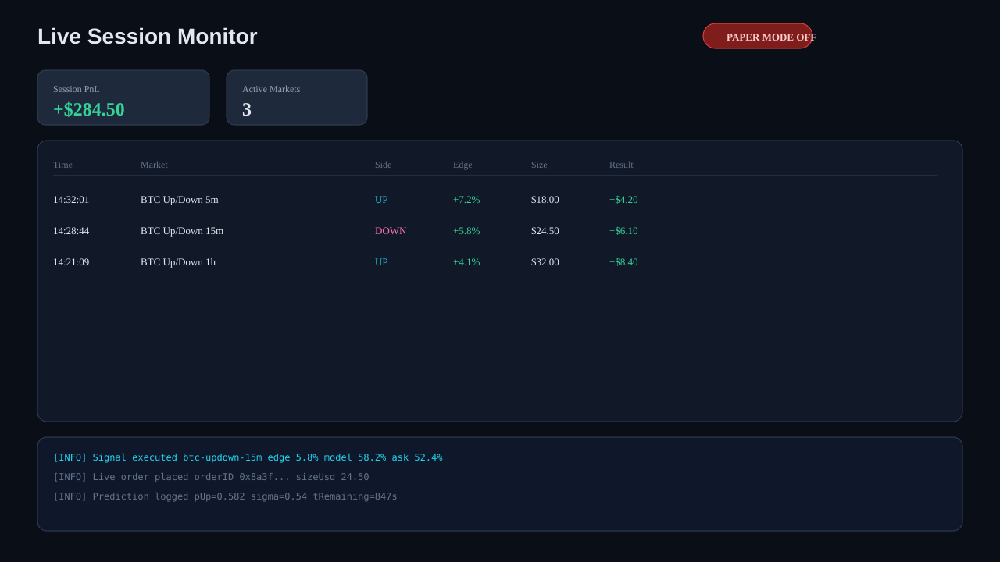

# Polymarket Trading Bot – AI Model Trading Bot for BTC 5m 15m 1h Up Down Markets | GBM Geometric Brownian Motion Probability Fair Value CLOB Arbitrage Bot

[](https://www.typescriptlang.org/)
[](https://nodejs.org/)
[](LICENSE)
[](#quick-start)

> **Production-oriented open-source Polymarket trading bot** for BTC Up/Down markets (5m · 15m · 1h). Estimates fair probability with **Geometric Brownian Motion (GBM)**, compares to Polymarket CLOB odds, and executes only when expected edge exceeds fees, spread, and slippage.

---

## Talk to the Developer

I built this bot because I wanted a **transparent, engineer-friendly Polymarket trading bot** — not a black box. I have achieved **decent results** in paper and live sessions, but I am actively pushing for **more profit** and smarter execution. If you are researching **polymarket trading bot** strategies, tuning GBM fair value, or experimenting with live CLOB execution — **please open a GitHub Discussion or Issue**. I genuinely want to connect, compare notes, and improve this project together.

---

## Dashboard Preview

Paper and live sessions produce structured logs; the panels below illustrate the analytics workflow this bot is designed for.

### PnL Overview


### Edge Analysis (GBM vs CLOB)


### Model Calibration & Brier Score


### Live Session Monitor



---

## Why This Bot?

| Feature | Description |
|---------|-------------|
| **GBM fair value** | Closed-form \(P(\text{Up})\) from spot, strike, time, and EWMA vol |
| **CLOB edge engine** | Trades only when edge beats fees + spread + slippage + `MIN_EDGE` |
| **Fractional Kelly sizing** | Quarter-Kelly default with hard USD caps |
| **Multi-timeframe** | `5m`, `15m`, `1h` BTC Up/Down via Gamma slug discovery |
| **Paper-first** | Simulated fills on live data — no keys required |
| **Live-ready** | `@polymarket/clob-client` integration when you opt in |
| **Calibration** | Predictions, Brier score, reliability buckets in JSONL logs |
| **Strict risk controls** | Daily loss limit, per-market cap, no martingale |

---

## Quick Start

```bash
git clone https://github.com/YOUR_USERNAME/polymarket-trading-bot-gbm-btc-up-down-clob-arbitrage.git
cd polymarket-trading-bot-gbm-btc-up-down-clob-arbitrage
cp .env.example .env
npm install
npm run paper
```

Minimal run (after install):

```bash
npm run paper
```

Run tests:

```bash
npm test
```

Build for production:

```bash
npm run build && npm start
```

---

## Strategy at a Glance

For each active BTC Up/Down window:

1. **Discover** markets via Gamma API (`btc-updown-5m-*`, `15m`, `1h`)
2. **Stream** BTC spot from Binance WebSocket
3. **Estimate** annualized σ with EWMA realized volatility
4. **Compute** GBM fair probability:

```
d2 = (ln(S0/K) + (μ - 0.5σ²)T) / (σ√T)
P_up = N(d2)
P_down = 1 - P_up
```

5. **Compare** model vs Polymarket CLOB best ask
6. **Trade** only if `edge > fees + half_spread + slippage + MIN_EDGE`
7. **Size** with fractional Kelly, capped by `MAX_TRADE_USD`
8. **Stop** new entries in the final 90s before resolution

Full math: [docs/gbm-strategy.md](docs/gbm-strategy.md)

---

## Configuration

Copy `.env.example` → `.env`:

```env
PAPER_MODE=true
MIN_EDGE=0.03
KELLY_FRACTION=0.25
MAX_TRADE_USD=50
MAX_LOSS_PER_DAY_USD=200
ENABLED_TIMEFRAMES=5m,15m,1h
STOP_BUYING_BEFORE_CLOSE_SEC=90
```

Live trading: set `PAPER_MODE=false` and add `PRIVATE_KEY` + `FUNDER_ADDRESS`.  
Guide: [docs/live-trading.md](docs/live-trading.md)

---

## Project Structure

```
.
├── src/
│   ├── index.ts                 # Entry point
│   ├── config/env.ts            # Environment loader
│   ├── bot/runner.ts            # Main orchestration loop
│   ├── modules/
│   │   ├── marketDiscovery.ts   # Gamma API + CLOB quotes
│   │   ├── priceFeed.ts         # Binance WebSocket
│   │   ├── volatilityEstimator.ts
│   │   ├── gbmModel.ts          # GBM fair probability
│   │   ├── edgeEngine.ts        # Edge vs cost stack
│   │   ├── riskManager.ts       # Limits & circuit breakers
│   │   ├── executionEngine.ts   # Paper + live CLOB
│   │   └── calibrationTracker.ts
│   ├── types/index.ts
│   └── utils/
├── tests/                       # GBM, edge, risk unit tests
├── docs/                        # Architecture, FAQ, guides
├── assets/dashboard/            # Analytics screenshots
├── .env.example
├── GITHUB_ABOUT.md              # SEO + About panel copy
└── README.md
```

Architecture diagram: [docs/architecture.md](docs/architecture.md)

---

## Engineering Highlights

- **Modular pipeline** — each concern (discovery, pricing, model, edge, risk, execution) is isolated and testable
- **Typed TypeScript** — strict mode, ESM, Node 18+
- **Structured logging** — JSONL for predictions, trades, resolutions
- **Test coverage** — GBM math, edge thresholds, risk caps
- **Sensible defaults** — paper mode, conservative Kelly, daily halt on max loss
- **Extensible** — Chainlink feed hook, Platt calibration, CLOB WebSocket upgrades

---

## API Integrations

| Service | Usage |
|---------|-------|
| [Polymarket Gamma API](https://gamma-api.polymarket.com) | Market discovery |
| [Polymarket CLOB](https://clob.polymarket.com) | Order book + live orders |
| [Binance WebSocket](https://binance-docs.github.io/apidocs/spot/en/#trade-streams) | BTC/USDT spot |
| `@polymarket/clob-client` | Live order placement |

---

## Performance Notes

This bot logs every prediction and fill so you can evaluate edge quality yourself. Dashboard screenshots in this README show the **intended analytics workflow** (PnL curve, edge breakdown, calibration, session monitor). Your results depend on market conditions, parameters, latency, and execution quality — tune on paper before going live.

---

## Troubleshooting

| Symptom | Fix |
|---------|-----|
| No BTC price | Check network; Binance WS may be blocked |
| No markets found | Verify `ENABLED_TIMEFRAMES`; Gamma slug patterns change |
| No trades | Raise logging; edge may be below `MIN_EDGE` |
| Live order fails | Balance, allowance, `PRIVATE_KEY`, chain ID 137 |

More: [docs/faq.md](docs/faq.md)

---

## Documentation

- [Architecture](docs/architecture.md)
- [GBM Strategy Math](docs/gbm-strategy.md)
- [Paper Trading](docs/paper-trading.md)
- [Live Trading](docs/live-trading.md)
- [FAQ](docs/faq.md)
- [How to Build a Polymarket Trading Bot](docs/how-to-build-polymarket-trading-bot.md)
- [GitHub About / SEO](GITHUB_ABOUT.md)
- [Publish Checklist](PREPARE_GITHUB.md)

---

## SEO Keywords

This repository targets developers and traders searching for:

`polymarket trading bot` · `polymarket bot` · `polymarket ai trading bot` · `polymarket ai bot` · `polymarket trading bot github` · `polymarket bot github` · `polymarket copy trading bot` · `polymarket sniper bot` · `polymarket arbitrage bot` · `polymarket market making bot` · `polymarket llm trading bot` · `polymarket ai agent` · `polymarket agent trading` · `polymarket news trading bot` · `polymarket automated trading` · `polymarket algo trading` · `polymarket trading bot python` · `polymarket trading bot typescript` · `polymarket trading bot nodejs` · `polymarket clob bot` · `polymarket clob api trading bot` · `polymarket api trading bot` · `how to build a polymarket trading bot` · `best polymarket trading bot` · `polymarket bot 2026` · `polymarket prediction market bot` · `prediction market trading bot` · `polymarket whale copy bot` · `polymarket telegram bot` · `polymarket autocopy bot` · `polymarket yes no arbitrage bot` · `polymarket btc 5 minute bot` · `polymarket up down bot` · `polymarket latency arb bot` · `polymarket fair odds bot` · `polymarket probability trading bot` · `polymarket open source trading bot` · `polymarket bot strategy` · `polymarket trading bot tutorial` · `polymarket bot dry run paper trading` · `polymarket ai news agent` · `polymarket multi agent trading bot` · `polymarket sentiment trading bot` · `build polymarket bot with ai` · `polymarket automated market maker bot` · `polymarket orderbook trading bot` · `polygon polymarket trading bot`

---

## Contributing — Especially Live Trading

This project is **powerful enough for real trading**, but the hardest problems are in **production execution** — latency, partial fills, resolution reconciliation, and calibration at scale. Contributions are welcome in these areas:

- **CLOB WebSocket** order book streaming (lower latency than REST polling)
- **Chainlink Data Streams** for settlement-aligned spot prices
- **Resolution polling** and automatic PnL / Brier updates
- **Platt scaling** or isotonic calibration on logged predictions
- **Risk modules** — portfolio exposure across concurrent 5m/15m/1h windows
- **Dashboard UI** — real-time panel over JSONL logs
- **CI / integration tests** with mocked Gamma and CLOB responses

```bash
# Development workflow
npm install
npm test
npm run dev
```

1. Fork the repository  
2. Create a feature branch  
3. Add tests for math/risk changes  
4. Open a PR with a clear description  

For strategy discussion, share your paper results in **GitHub Discussions** — I am actively looking for collaborators who care about **real edge**, not hype.

---

## Security

- Never commit `.env` or private keys  
- Start with `PAPER_MODE=true`  
- Use a dedicated wallet with limited funds for live trading  
- Review [docs/live-trading.md](docs/live-trading.md) before enabling live mode  

---

## License

MIT — see [LICENSE](LICENSE).

---

**Polymarket Trading Bot – AI Model Trading Bot for BTC 5m 15m 1h Up Down Markets | GBM Geometric Brownian Motion Probability Fair Value CLOB Arbitrage Bot**

*Built for engineers who want to read the code, run the bot, and talk about what actually works.*
