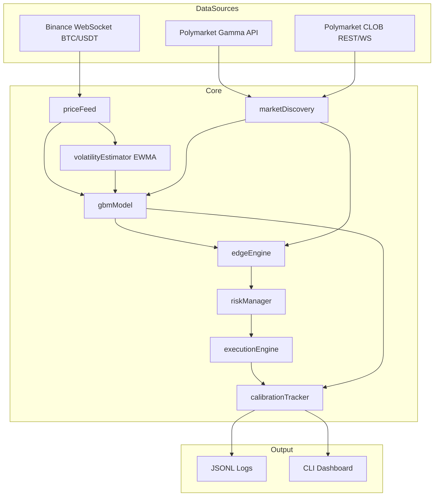

# Architecture

## System Overview

## Module Responsibilities

| Module | Role |
|--------|------|
| `marketDiscovery` | Finds active `btc-updown-{5m,15m,1h}-*` markets via Gamma API; fetches CLOB order books |
| `priceFeed` | Streams Binance BTC trades; optional Chainlink hook point |
| `volatilityEstimator` | EWMA annualized sigma from log returns |
| `gbmModel` | Computes P(Up) and P(Down) under GBM |
| `edgeEngine` | Compares model vs ask; computes Kelly-sized edge |
| `riskManager` | Caps size, daily loss, per-market exposure; resolution cutoff |
| `executionEngine` | Paper simulation or live CLOB orders |
| `calibrationTracker` | Predictions, fills, Brier score, reliability buckets |

## Data Flow (single tick)

1. Receive latest BTC price from Binance.
2. Update EWMA volatility.
3. Discover open BTC Up/Down markets for enabled timeframes.
4. For each market: read S₀, K, T, σ → GBM fair odds.
5. Fetch UP/DOWN token best asks from CLOB.
6. Compute edge; filter by cost stack + `MIN_EDGE`.
7. Risk manager approves fractional Kelly size (capped).
8. Execute (paper or live); log prediction + trade.
9. On resolution: log outcome, PnL, Brier score.

## Configuration Layers

- **Environment** (`.env`): secrets, limits, timeframes, mode
- **Strategy constants**: GBM formula, edge cost model
- **Runtime**: bankroll assumption, loop interval

See [GBM Strategy](./gbm-strategy.md) and [Live Trading](./live-trading.md).
